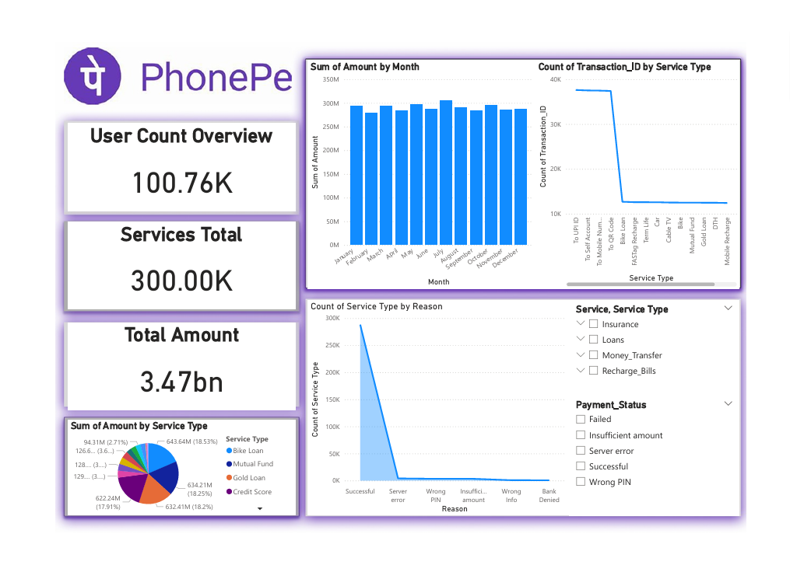
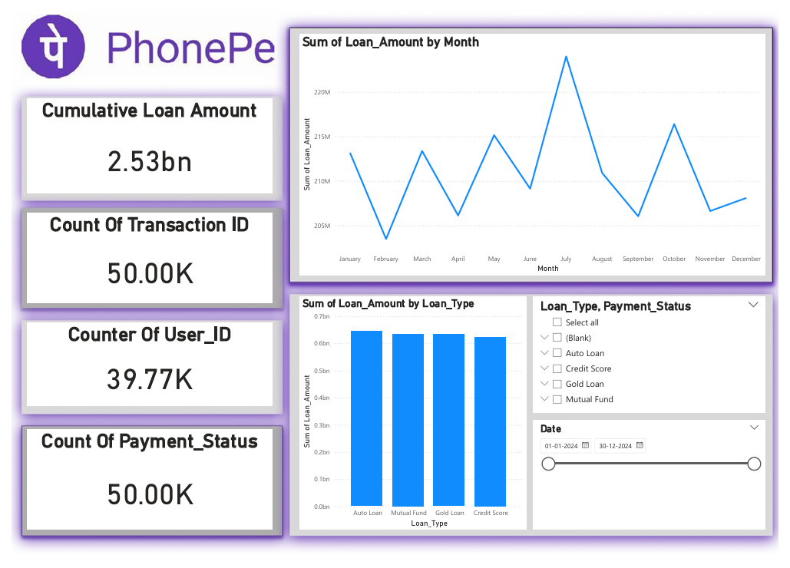
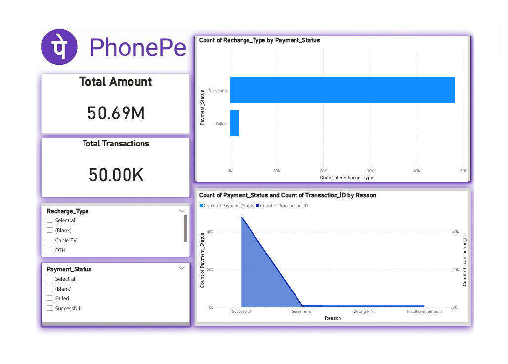
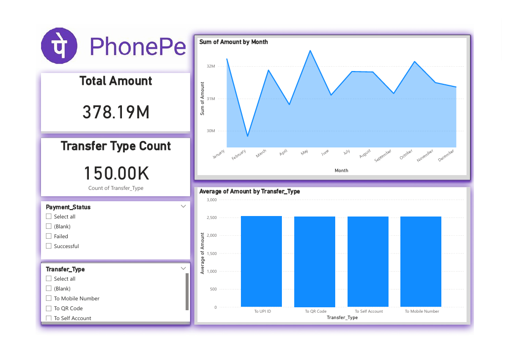
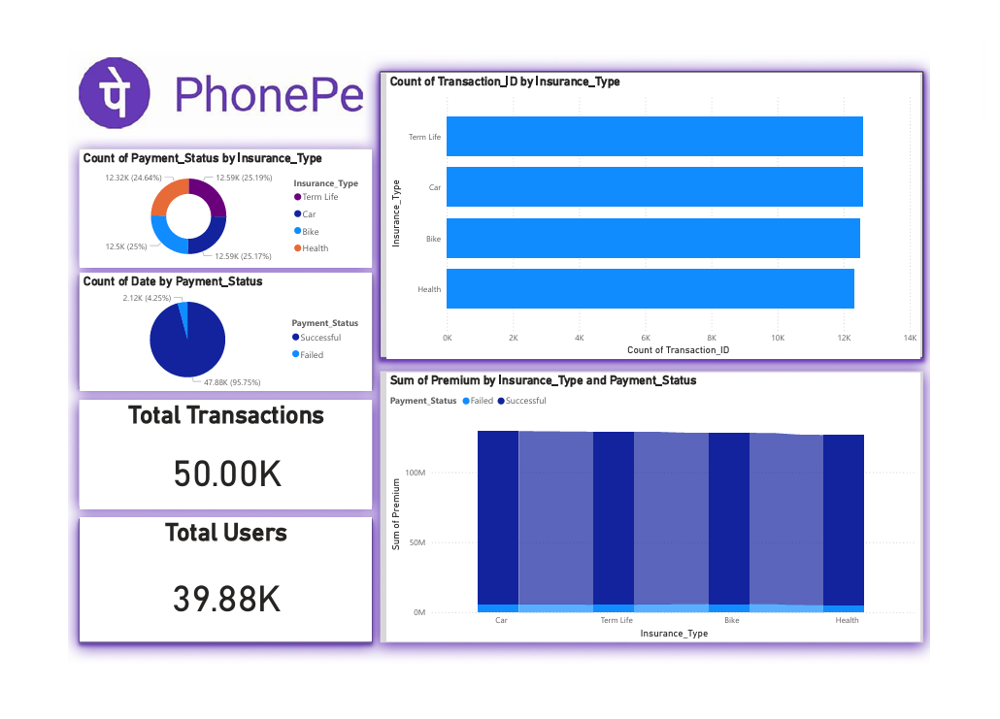

# 📊 PhonePy Power BI Analytics Dashboard

This project presents a comprehensive **Power BI analytics dashboard** built using the **PhonePy dataset**, offering insights into transactions, services, loans, insurance, recharges, and transfers.  
The dashboard helps stakeholders analyze customer behavior, financial performance, and service trends across multiple business areas.

---

## 🚀 Project Overview

The PhonePy Dashboard delivers insights for:

- 📈 Loan Analytics  
- 💳 Transaction Insights  
- 🧑‍💼 User Distribution  
- 🛠️ Service Analysis  
- 🛡️ Insurance Analytics  
- 🔁 Transfer Type Metrics  
- 🔌 Recharge & Bill Trends  

This dashboard is created to understand revenue trends, payment behavior, customer activity, and operational efficiency.

---

## 📂 Dashboard Pages

### **1️⃣ Loan Analysis**
- Cumulative Loan Amount  
- Count of Transaction IDs  
- User Count  
- Count of Payment Status  
- Loan Amount by Month  
- Loan Amount by Loan Type  
- Filters: Loan Type, Payment Status, Date  

---

### **2️⃣ Service Analysis**
- User Count Overview  
- Total Services  
- Total Amount  
- Amount by Service Type  
- Monthly Amount Trends  
- Transaction Count by Service Type  
- Service Type by Failure Reason (Server Error, Wrong PIN, etc.)  

---

### **3️⃣ Insurance Analysis**
- Total Users  
- Total Transactions  
- Payment Status by Insurance Type  
- Date Count by Payment Status  
- Transaction IDs by Insurance Type  
- Premium Amount by Insurance Type & Payment Status  

---

### **4️⃣ Transfer Analysis**
- Total Amount  
- Transfer Type Count  
- Monthly Transfer Amount Trends  
- Average Amount by Transfer Type  
- Filters: Payment Status, Transfer Type  

---

### **5️⃣ Recharge & Bills Analysis**
- Total Amount  
- Total Transactions  
- Recharge Type by Payment Status  
- Payment Status & Transaction Count by Reason  
- Filters: Recharge Type, Payment Status  

---

## 🧰 Tools & Technologies Used

- Power BI Desktop  
- DAX (Measures & Calculations)  
- Data Modeling (Relationships, Star Schema)  
- Data Cleaning & Transformation  
- Line charts, Bar charts, Donut charts, Cards, Slicers  

---

## 🧮 Key Metrics

- Total Users  
- Total Transactions  
- Total Amount  
- Sum of Loan Amount  
- Count of Payment Status  
- Count of Transaction IDs  
- Average Transaction Amount  
- Premium Amount Summary  
- Monthly Trends  
- Type-wise Distribution (Service, Insurance, Transfer, Recharge)  

---

## 📌 Purpose of the Dashboard

This dashboard helps businesses to:

- Monitor customer activity  
- Analyze revenue and loan performance  
- Identify failure reasons in transactions  
- Track insurance and premium trends  
- Understand transfer and recharge patterns  
- Make data-driven decisions  

---

## 📁 Project Files

- `PhonePy.pbit` – Power BI Template File  
- `PhonePy.pdf` – Dashboard Export (PDF)  
- Power BI Visuals included across 5 pages  

---

## 📊 Dashboard Preview

|PhonePe – All Transactions Dashboard | PhonePe - Loan Analytics Dashboard |
|--------------------|-------------------|
|  |  |

|PhonePe Recharge & Bills Analytics Dashboard | PhonePe Money Transfer Analytics Dashboard |PhonePe Insurance Analytics Dashboard |
|---------------|----------------|-------------|
|  |  |  |

